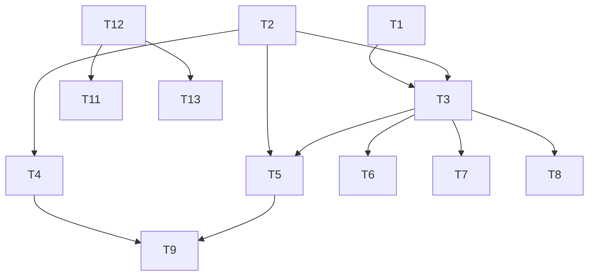

### TASK — AI 编程新闻网站（原子任务与依赖）

| ID  | 任务                             | 说明                                                            | 依赖        |
| --- | -------------------------------- | --------------------------------------------------------------- | ----------- |
| T1  | 初始化 Supabase 客户端与公共配置 | 在前端集中封装 `supabaseClient`，读取 `PUBLIC_SUPABASE_URL/KEY` | -           |
| T2  | 页面骨架与导航/页脚              | 复用 `Layout.astro`，新增页面路由与统一导航                     | -           |
| T3  | Auth 页面与个人资料              | 登录注册、资料读取与更新、头像上传                              | T1,T2       |
| T4  | 首页新闻流                       | 列表/搜索/筛选/分页、点赞/收藏                                  | T1,T2       |
| T5  | 论坛/问答页面                    | 双标签、发帖/提问、列表/详情、评论/举报/互动                    | T1,T2,T3    |
| T6  | 投稿与上传                       | 上传校验、存储、发布                                            | T1,T3       |
| T7  | 消息与通知                       | 私信与系统通知列表/会话                                         | T1,T3       |
| T8  | 反馈与附件                       | 反馈表单与上传，10MB 限制                                       | T1,T3       |
| T9  | 积分与等级                       | 规则实现、视图展示、触发流水                                    | T1,T3,T4,T5 |
| T10 | 敏感词与校验模块                 | 敏感词库与通用校验                                              | T2          |
| T11 | 抓取函数                         | `crawler.js` 定时抓取 20 源，入库 `news_items`                  | T12         |
| T12 | Netlify 配置                     | `netlify.toml` 指定函数目录为 `netlify`                         | -           |
| T13 | AI 代理函数                      | `aiProxy.js` 路由多家厂商 API                                   | T12         |
| T14 | 静态法务页面                     | 关于/隐私/协议/网站介绍                                         | T2          |
| T15 | 基础测试                         | 无框架前端测试 `tests.html`+`tests.spec.js`                     | T3,T4,T5    |

依赖图（Mermaid）：

